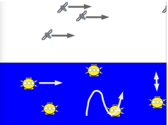

# Satellites Balises

Sujet du cours de l'UE Conception du Master 2 TIIL-A. \
Travail en équipe de 5. \
Conception et développement logiciels.

## Sommaire

1. [Sujet](#sujet) \
    1.1 [Présentation du scénario](#présentation-du-scénario) \
    1.2 [Les éléments mobiles](#les-éléments-mobiles) \
    1.3 [Étape de collecte](#étape-de-collecte) \
    1.4 [Étape de synchronisation](#étape-de-synchronisation) \
    1.5 [Plan de travail](#plan-de-travail)
1. [Équipe](#équipe)
1. [Technologies utilisées](#technologies-utilisées)
1. [Installation & Lancement](#installation-lancement)

## Sujet

### Présentation du scénario

Une entreprise spécialisée dans l’étude des océans organise des campagnes de mesure de caractéristiques physiques comme la température, les courants, la luminosité et la composition du milieu marin. Pour cela, un ensemble de balises autonomes sont larguées dans les zones à étudier. \
Une fois lancée, une balise effectue le cycle suivant :
- Etape d’enregistrement : la balise plonge et se déplace dans l’eau ; elle effectue des mesures
et les enregistre ;
- Etape de remontée et de synchronisation : la balise remonte en surface et se place en attente
de synchronisation avec un satellite ;

### Les éléments mobiles

La simulation met en œuvre des éléments mobiles : des balises et des satellites. \
Les satellites se déplacent autour de la terre, toujours dans le même sens. Leur vitesse de déplacement est variable et certains peuvent être géostationnaires. \
Les balises se déplacent dans le milieu. Le déplacement est variable. Dans un premier temps, sa nature est décidée lors de la programmation de la balise à terre. Par exemple, comme le montre la figure ci-dessous, un déplacement peut être horizontal, vertical ou bien sinusoïdal. La balise peut aussi rester immobile à une certaine profondeur.

### Étape de collecte

Le rôle d’une balise est de collecter des données dans le milieu marin. L’étape de collecte consiste pour la balise à enregistrer des données et les stocker dans sa mémoire. Lorsque sa mémoire est pleine, elle entame une procédure d’émission de ses données vers un satellite pour pouvoir reprendre la collecte.

### Étape de synchronisation

Pour vider sa mémoire, une balise remonte à la surface. Elle attend le passage d’un satellite disponible avec lequel elle est en mesure de se synchroniser. Etre en mesure de se synchroniser signifie que le satellite est disponible et qu’il se situe au dessus de la balise comme le montre la figure ci-dessous.

Lorsque la balise et un satellite sont synchronisés, la balise envoie les données au satellite. Quand toutes les données sont transférées, la balise repasse à l’étape de collecte.

### Plan de travail

Il est demandé de programmer une simulation avec une visualisation graphique. Au cours d'une simulation, un ensemble de satellites et de balises sont visibles et se caractérisent par des stratégies
de déplacement différentes.

La simulation doit mettre en évidence la synchronisation entre une balise et un satellite. Par exemple, par une ligne reliant le satellite à la balise ou par un changement de couleur des vues. Pour cette simulation, les patrons Stratégie et Observable/Observateur doivent être utilisé pour respectivement :
- la mise en œuvre du déplacement des balises
- la synchronisation entre une balise et un satellite.

## Équipe 

L'équipe est composée de 5 étudiants de Master 2 TIIL-A : 
- [Alexia Sorin](https://gitlab.com/asorin.alexia)
- [Marie Le Buhan](https://gitlab.com/marie.lebuhan)
- [Jonathan Bayle](https://gitlab.com/Sifey)
- [Louis Dosnon](https://gitlab.com/louisdosnon)
- [Christophe Garcia](https://gitlab.com/G.Christophe)

Le professeur est Alain Plantec.

## Technologies utilisées

| Technologie | Utilité | 
|-----------|-----------|
| Java | Développement |
| JUnit | Test unitaires |
| Swing | Interface graphique |
| Nicellipse | Librairie pour Interface graphique |
| Gitlab | Gestion des versions |
| Suite Google | Documents |

## Installation & Lancement

**Installation** : clonez le projet et importez le sur votre IDE favori.

**Exécution** : téléchargez le zip puis lancez le jar.